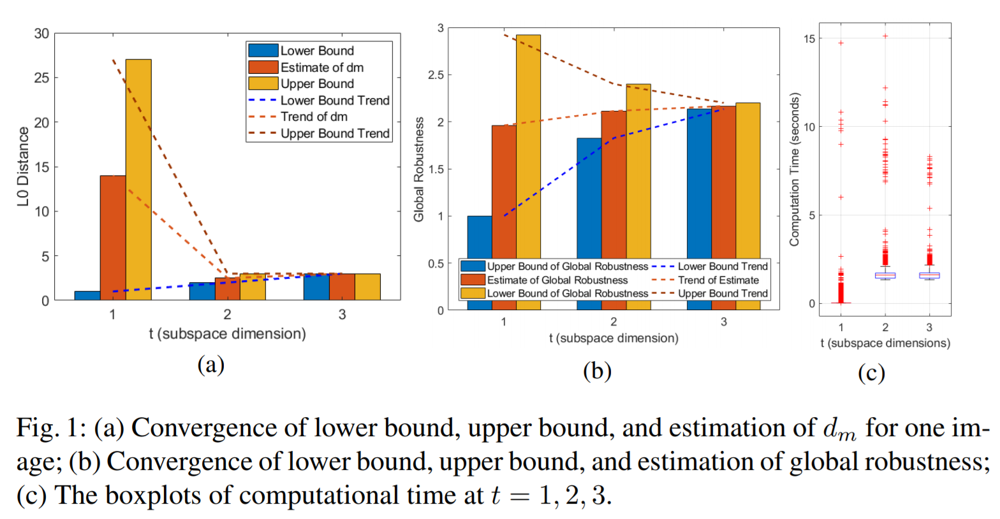
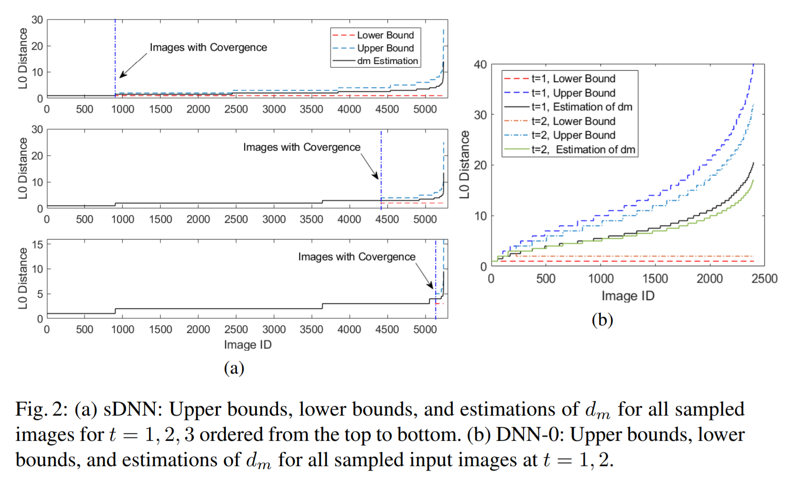
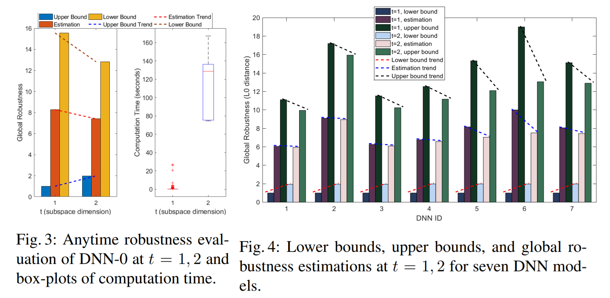
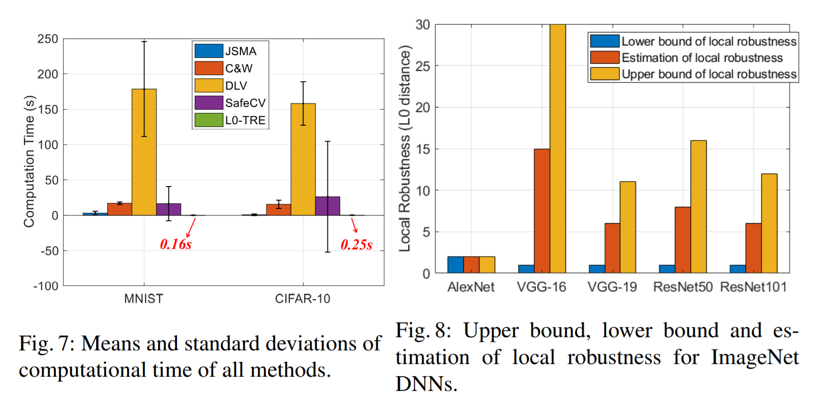
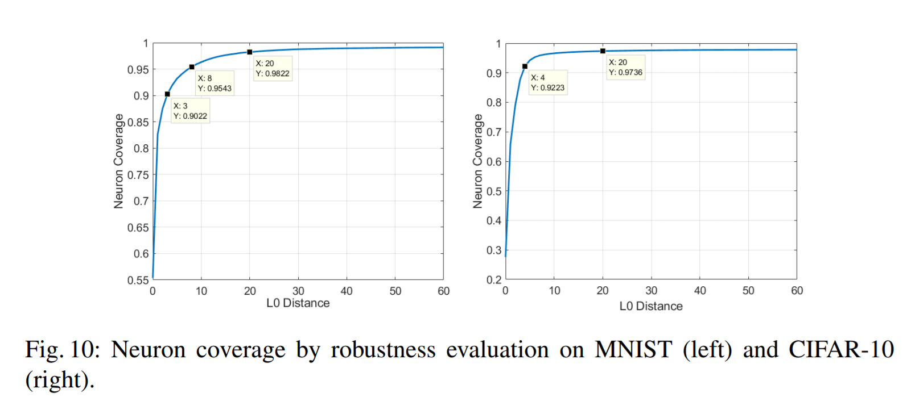
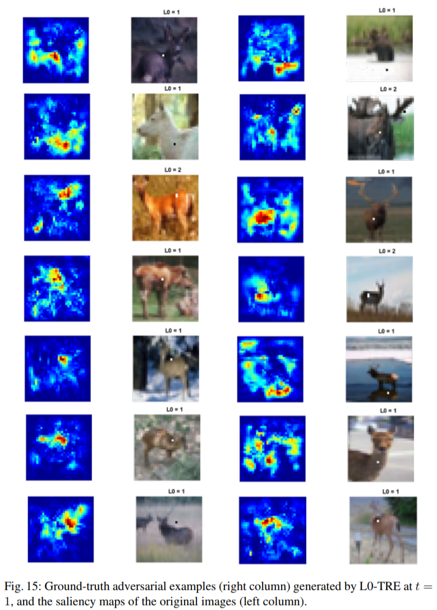

# Tool: L0-TRE (Tensor-based Robustness Evaluation on DNN for L0-Norm)

Global Robustness Evaluation of Deep Neural Networks with Provable Guarantees for L0 Norm

Wenjie Ruan, Min Wu, Youcheng Sun, Xiaowei Huang, Daniel Kroening, Marta Kwiatkowska.

arXiv:1804.05805 https://arxiv.org/abs/1804.05805

# Abstract
Deployment of deep neural networks (DNNs) in safety or security-critical systems demands provable guarantees on their correct behaviour. One example is the robustness of image classification decisions, defined as the invariance of the classification for a given input over a small neighbourhood of images around the input. Here we focus on the L_0 norm, and study the problem of quantifying the global robustness of a trained DNN, where global robustness is defined as the expectation of the maximum safe radius over a testing dataset. We first show that the problem is NP-hard, and then propose an approach to iteratively generate lower and upper bounds on the network's robustness. The approach is anytime, i.e., it returns intermediate bounds and robustness estimates that are gradually, but strictly, improved as the computation proceeds; tensor-based, i.e., the computation is conducted over a set of inputs simultaneously, instead of one by one, to enable efficient GPU computation; and has provable guarantees, i.e., both the bounds and the robustness estimates can converge to their optimal values. Finally, we demonstrate the utility of the proposed approach in practice to compute tight bounds by applying and adapting the anytime algorithm to a set of challenging problems, including global robustness evaluation, guidance for the design of robust DNNs, competitive L0 attacks, generation of saliency maps for model interpretability, and test generation for DNNs. We release the code of all case studies via Github.


# Sample Results













# Run
Please run this tool by referring to different case studies folders

# Citation
```
@ARTICLE{2018arXiv180405805R,
   author = {{Ruan}, Wenjie and {Wu}, Min and {Sun}, Youcheng and {Huang}, Xiaowei and {Kroening}, Daniel and 
	{Kwiatkowska}, Marta},
    title = "{Global Robustness Evaluation of Deep Neural Networks with Provable Guarantees for L0 Norm}",
  journal = {ArXiv e-prints},
archivePrefix = "arXiv",
   eprint = {1804.05805},
     year = 2018,
    month = apr,
   adsurl = {http://adsabs.harvard.edu/abs/2018arXiv180405805R}
}
```
# Remark
This tool is under active development and maintenance, please feel free to contact us about any problem encountered. 

# Contribution List of the Case Studies:

Case Study One: Convergence Analysis and Global Robustness Evaluation (Wenjie Ruan, wenjie.ruan@cs.ox.ac.uk)

Case Study Two: Guidance for the Design of Robust DNN Architecture (Wenjie Ruan, wenjie.ruan@cs.ox.ac.uk)

Case Study Three: Competitive L0 Attack (Min Wu, min.wu@cs.ox.ac.uk)

Case Study Four: Saliency Map and Local Robustness Evaluation for Large-scale ImageNet DNN Models (Wenjie Ruan, wenjie.ruan@cs.ox.ac.uk)

Case Study Five: DNNs Test Case Generation (Youcheng Sun, youcheng.sun@cs.ox.ac.uk)